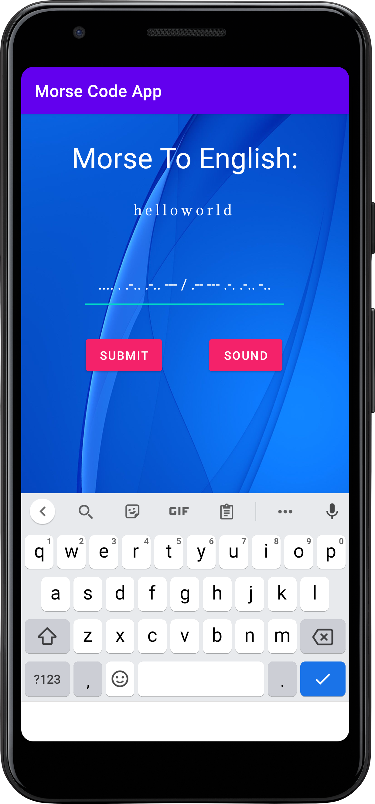

# Morse Code Converter App

This Android app allows users to convert text to Morse code and vice versa. Additionally, users can play the Morse code as sound for better understanding.

## Features

- **Morse to English Conversion:** Convert Morse code to English text.
- **English to Morse Conversion:** Convert English text to Morse code.
- **Audio Playback:** Play the Morse code as audio for auditory learning.

## Getting Started

### Prerequisites

- Android Studio installed on your development machine.
- Android device or emulator to run the application.

### Installation

1. Clone the repository:

   ```bash
   git clone https://github.com/Hardvan/Morse-Code-App.git
   ```

2. Open the project in Android Studio.

3. Build and run the application on your Android device or emulator.

## Usage

1. Enter the text in the input field.
2. Press the "Submit" button to convert the text.
3. View the conversion result in the designated area.
4. If the input is Morse code, an additional "Play Sound" button will appear. Click it to listen to the Morse code.

## Screenshots



